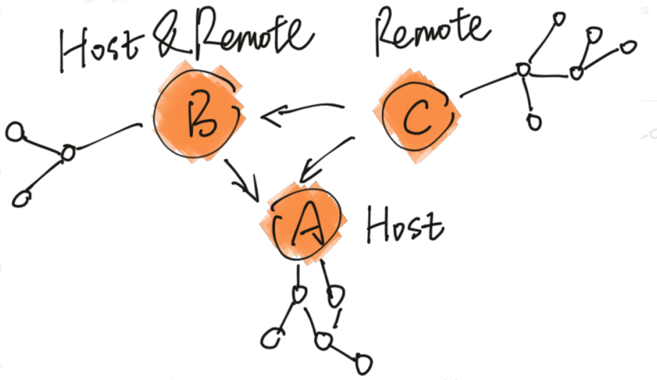

# webpack5 搞微前端

## Module Federation（联邦模块）

### 几个概念

Host：消费其他 Remote 的 Webpack 构建；

Remote：被 Host 消费的 Webpack 构建；

<div align="left">
    
</div>

一个构建产物可以同时是 Host 和 Remote

### 配置

```
new ModuleFederationPlugin({
    name: 'name',                   // 模块名称
    filename: 'remoteEntry.js',     // 模块入口
    remotes: {                      // 引用模块
        app1: 'app1@http://localhost:3002/remoteEntry.js',
        app2: 'app2@http://localhost:3003/remoteEntry.js',
    },
    exposes: {                      // 导出模块
        './Layout': './src/Layout',
    },
    shared: {                       // 共享模块
        ...deps,
        react: { singleton: true, requiredVersion: deps.react },
        'react-dom': {
            singleton: true,        // 版本是否需要唯一
            eager: true,            // 是否同步加载
            requiredVersion: deps['react-dom'],  // 版本-如果可以任意版本可以设置成false
        },
    },
}),
```

### 特点

1. 运行时使用模块
2. 依赖模块可共享、版本不一致可配置（优先使用 host 的，host 没有或者版本不一致再加载自己的）

## 示例

### 三个应用（basic、app1、app2）

basic：基座应用-部署时的主应用、包含部分公用页面、全局 store、通用样式等

app1：演示父子通讯、跳转、多版本包

app2：演示 remoteEntry.js 懒加载

### 优势

1. 微前端的优点
2. 没有代码冗余
3. 简单

### 问题

1. 样式冲突--命名空间、style-components
2. entry 多个--可优化（是否可以动态应用模块 entry[文档](https://webpack.docschina.org/concepts/module-federation/#dynamic-remote-containers)）

# 参考

[官方文档](https://webpack.docschina.org/concepts/module-federation)

[官方 Demo](https://github.com/module-federation/module-federation-examples)

[Webpack 5 Module Federation: JavaScript 架构的变革者](https://zhuanlan.zhihu.com/p/120462530)
